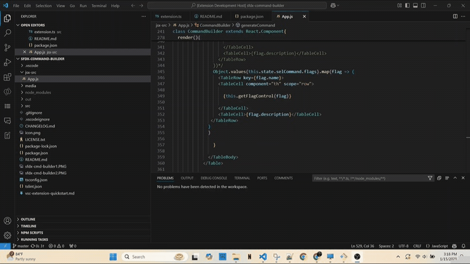
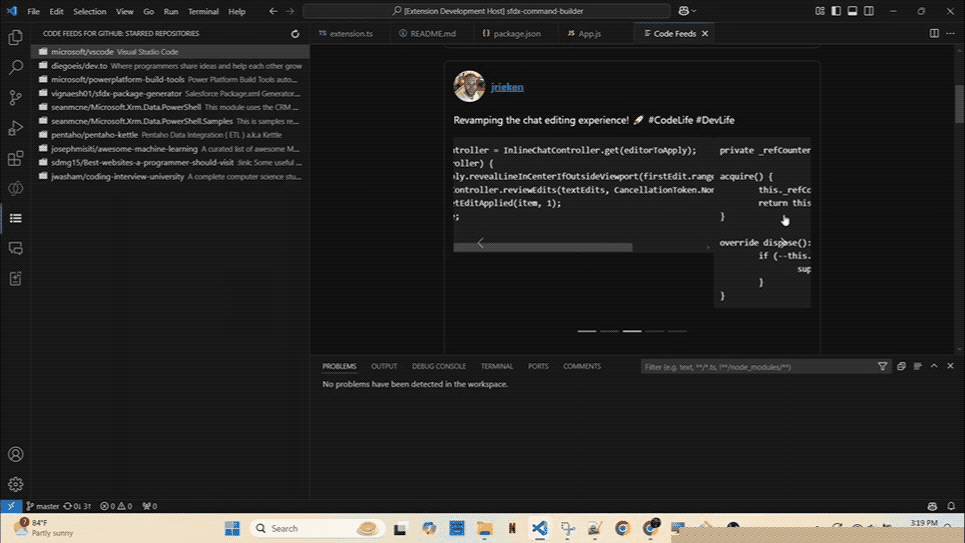
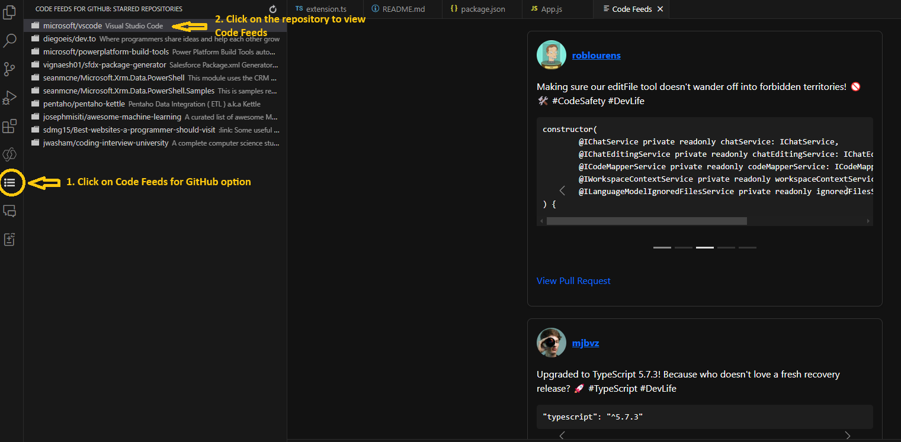
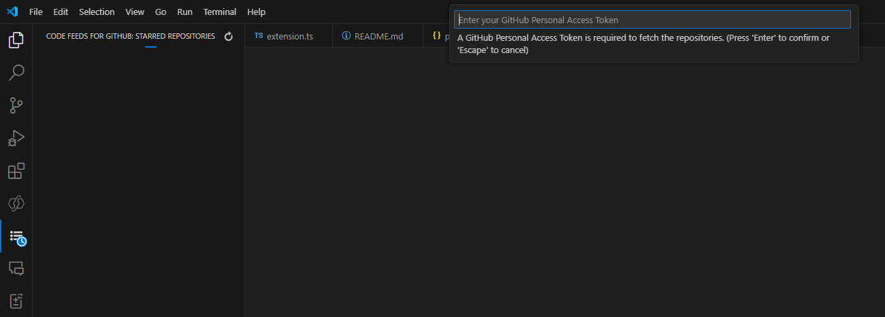

# Code Feeds for GitHub

🚀 **Code Feeds for GitHub** is a fun and engaging VS Code extension that brings the latest changes to your favorite GitHub repositories (the ones you've ⭐ Starred) directly to your editor. Visualize those pull requests and code changes like never before – in a trendy, Instagram-style feed format complete with catchy captions! 🎉 

> Because boring changelogs are so yesterday. ✨

---

## 🌟 Features

- 📸 **Instagram-Styled Feed:** View recent pull requests from your starred repositories in a visually engaging feed.
- 💬 **Catchy Captions:** Let the AI (powered by GPT-4) generate fun, trendy, and insightful captions for every code update.
- 🔢 **Top 10 Updates:** Get a snapshot of the **10 most recent pull requests** and stay up-to-date.
- 🔍 **Quick Browsing:** Look at specific repositories' feed to manage your coding focus with flair.
- 🚦 **AI Insights:** Powered by **GitHub Copilot's GPT-4o model**, giving life to your code updates with human-like creativity.

---

## 🛠️ Prerequisites

Before using **Code Feeds for GitHub**, make sure you meet the following requirements:

1. **GitHub Copilot in VS Code**  
   You must have **GitHub Copilot** enabled in your VS Code. If it's not set up, you can follow the [GitHub Copilot Installation Guide](https://docs.github.com/copilot/).

2. **GitHub Personal Access Token**  
   Create a **Personal Access Token** from your GitHub account with **read permissions** to retrieve data from your starred repositories.  
   ➡️ Follow the [GitHub PAT Setup Guide](https://docs.github.com/en/authentication/keeping-your-account-and-data-secure/creating-a-personal-access-token) to create one.

---

## 🚀 How to Use

1. **Install the Extension:**  
   Head over to the Visual Studio Code marketplace and install **Code Feeds for GitHub**.

2. **Add Your GitHub Personal Access Token:**  
    Click on **Code Feeds for GitHub** icon in the Activity bar and paste your token in the input field provided.

3. **Enable GitHub Copilot:**  
   Ensure you've got **GitHub Copilot** enabled in your VS Code workspace for those catchy captions!

4. **Open the Code Feed Panel:**  
   Click on **Code Feeds for GitHub** icon in the Activity bar. Click on a GitHub repository. Enjoy the feed!

---

## 📂 Demo Time!

### 🎥 **Check out the demos:**  

_Visualizing how your code updates will feel like scrolling through Instagram for devs._

---

### 📸 Screenshots  

**1. Feed Layout with Trendy Captions**  

**2. Adding GitHub Personal Access Token**  

---

## ⚠️ Limitations

- **Top 10 Pull Requests Only:** Due to current limitations of the GPT-4o API (used via GitHub Copilot), the feed is capped to show the **10 most recent pull requests**.
- **Slowness due to Real-Time Feed generation:** Feeds are generated by the AI model in real time, so you could see 10-15 sec delay.

---

## 🏆 Why You'll Love It

- **Stay Updated at a Glance:** No need to dig through boring pull request histories. Visualize recent changes to your favorite repositories.
- **Inject Fun into Productivity:** Coding is serious business, but your feeds don’t have to be. Code Feeds keeps you informed and entertained.
- **Powered by GPT-4o AI Brilliance:** Experience next-level AI creativity in your extensions. Your code feeds are smarter (and wittier) than ever!

---

## 📚 Contributing

Contributions are welcome! Open a PR or submit an issue for bug reports, feature requests, or enhancements. Let’s make this extension even better together.

---

## 📜 License

**Code Feeds for GitHub** is licensed under the [MIT License](LICENSE.TXT).

---